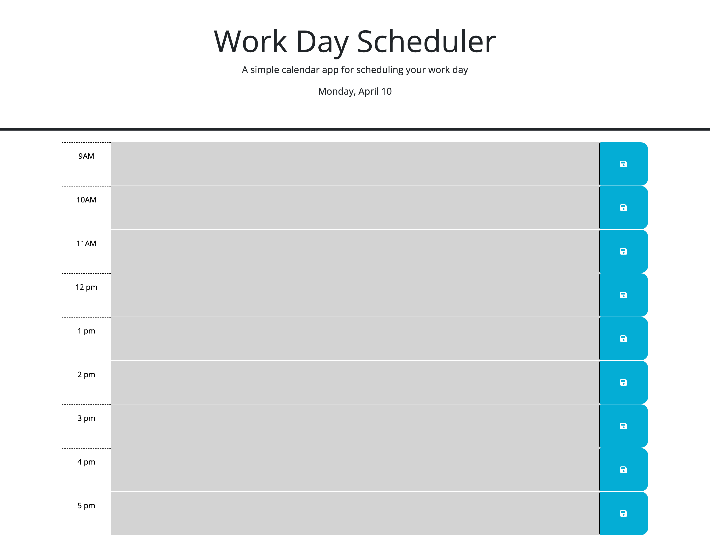

# planner

For my weekday planner, I created a page that will log the current time and update the page according to whether or not it is the current hour, a previous hour, or a future hour. I made it so that you can add to the planner and have the content be saved in local storage so that you can continue to update the planner throughout the day.

I did receive some help from a tutor on this assignment, specifically regarding JQuery syntax and DOM traversal, so that I could successfully gather the necessary data to update the webpage.

